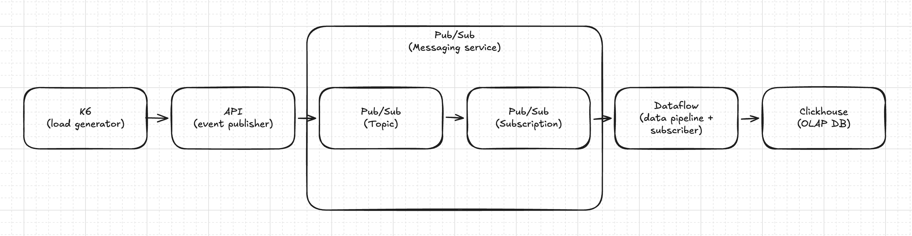

# Local Pub/Sub To ClickHouse Dataflow



This project runs a local Pub/Sub to ClickHouse ingestion stack with Docker Compose:

- FastAPI event producer
- GCP Pub/Sub emulator
- Local Apache Beam `DirectRunner` execution of the upstream `PubSubToClickHouse` template
- ClickHouse
- k6 load generator

## Run

```sh
docker compose up --build
```

Publish one event:

```sh
curl -X POST http://localhost:8000/events
```

Publish a manual burst:

```sh
curl -X POST 'http://localhost:8000/events/batch?count=20'
```

Query ClickHouse:

```sh
docker compose exec clickhouse clickhouse-client --query "SELECT count() FROM events"
docker compose exec clickhouse clickhouse-client --query "SELECT * FROM events ORDER BY occurred_at DESC LIMIT 5 FORMAT Vertical"
```

Run the k6 load generator:

```sh
docker compose --profile load run --rm k6
```

Override the default k6 settings:

```sh
K6_VUS=20 K6_DURATION=1m K6_SLEEP=0.2 docker compose --profile load run --rm k6
```

Publish a malformed message to exercise dead-letter handling:

```sh
docker compose exec pubsub env PUBSUB_EMULATOR_HOST=localhost:8085 \
  gcloud pubsub topics publish events --message='not valid json' --project=local-project
```

Check the ClickHouse dead-letter table:

```sh
docker compose exec clickhouse clickhouse-client --query "SELECT raw_message, error_message, failed_at FROM events_dead_letter ORDER BY failed_at DESC LIMIT 5 FORMAT Vertical"
```
